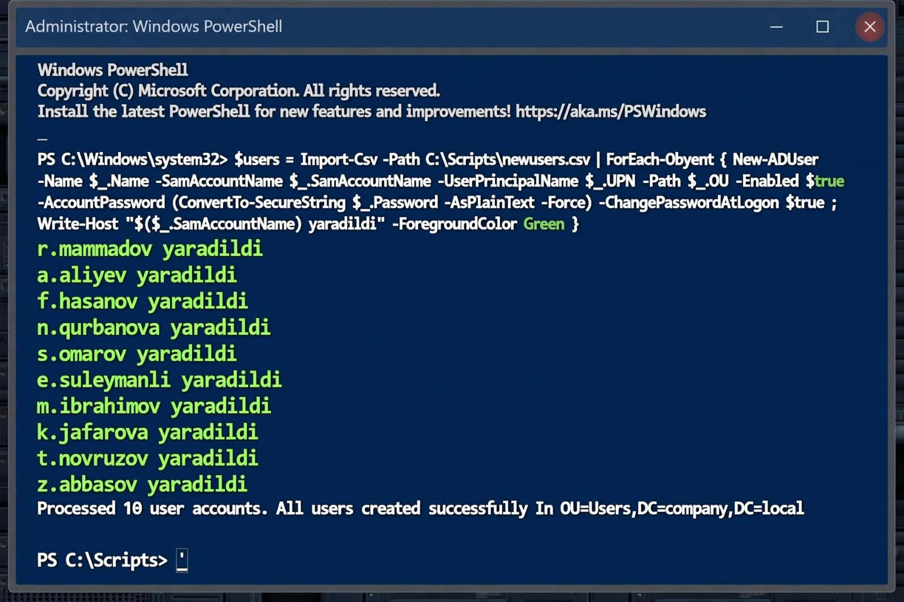
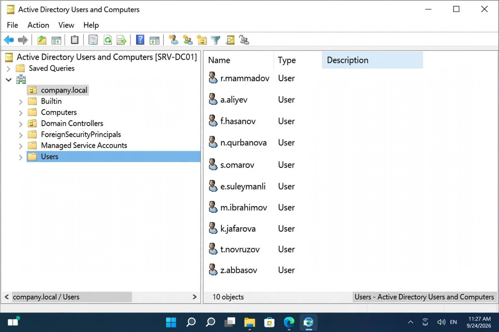

# AD User Onboarding Automation - PowerShell Lab

> Automated 30 minutes of manual HR onboarding work into 30 seconds.

This lab automates bulk creation of 10 Active Directory users using PowerShell. Real-world scenario: HR sends an Excel file, the script creates all users automatically.

### 🎯 The Problem
- Creating users manually in ADUC is time-consuming
- Typing errors in SamAccountName / UPN
- Same OU and password policy repeated for every user

### ✅ The Solution
With PowerShell:
- 10 users created with 1 command
- All users placed in `OU=Users,DC=company,DC=local`
- Default password: `Crucel123!` + force change at next logon
- Green confirmation output in console

### 🛠️ Tech Stack
- Windows Server 2022
- Active Directory PowerShell Module
- `New-ADUser`, `ConvertTo-SecureString`, `Import-Csv`

### 📸 Lab Results

**1. PowerShell Execution:**


**2. Verification in ADUC:**


### 🚀 How to Run

1. Import AD module:
```powershell
Import-Module ActiveDirectory
